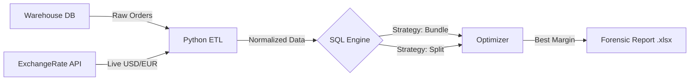

# 🛒 Smart Procurement Engine: Automated Margin Protection


> **A Python/SQL engine designed to eliminate "Invisible Margin Leakage" in high-volume B2B procurement. It automates complex vendor selection, handling real-time currency volatility (USD/EUR) and logistics constraints.**

---

## 🔴 The Business Problem
In high-volume supply chains, manual procurement processes are the silent killers of profitability.

* **Invisible Margin Leakage:** When ordering 50+ components across 15+ suppliers, a human operator physically cannot calculate the millions of possible combinations (Bundle vs. Split). They often default to the "usual supplier," missing out on **5-15% of potential margin**.
* **The "Currency Trap" Multiplier:** Complexity explodes when suppliers trade in different currencies (USD/EUR). Manually checking live Forex rates for every line item is impossible, leading to purchases made at unfavorable static rates.
* **Lack of Scalability:** Manual Excel comparisons break down at 1,000 items, creating bottlenecks and critical data entry errors.

---

## 🟢 The Solution
I built an automated **ETL & Decision Pipeline** that acts as a financial safeguard layer between the ERP demand and the purchase order.

### System Architecture



The pipeline follows strict logic:

1. **Ingestion:** Connects to the Warehouse Database (SQLite) to fetch the Shopping_List.
2. **Enrichment:** Hits the ExchangeRate-API to fetch the live USD/EUR factor, normalizing all prices to a common baseline.
3. **Optimization Logic:** Uses SQL Window Functions to evaluate "Single Source" vs "Multi-Vendor" strategies, accounting for Shipping Thresholds and MOQs.
4. **Forensic Output:** Generates a line-by-line Drill-Down Audit, justifying exactly why a specific supplier won.

---

## 🧪 Case Study: The "Razor Thin" Stress Test (Order #888)

To validate the engine, I simulated a high-value order during a favorable USD/EUR exchange window to test the Forex Arbitrage Logic.

* **Manual Scenario (Standard EU Supplier):** € 3,062.50
* **Automated Scenario (US Supplier + Live Forex):** € 2,695.68

📉 **Immediate Impact:** € 366.82 Saved (12% Margin)

**Insight:** The engine correctly identified that despite higher nominal shipping costs ($29.91), the currency arbitrage opportunity outweighed the logistics fees. A manual operator using static monthly rates would have missed this saving.

---

## ⚡ Key Technical Features

### 1. Dynamic Forex Adaptation
The engine removes the risk of static pricing by fetching real-time market data.

```python
# Real-time financial resilience
def get_live_forex_factor():
    try:
        response = requests.get(FOREX_API_URL)
        rate = response.json()['rates']['USD']
        return 1 / rate 
    except:
        return FALLBACK_RATE
```

### 2. "Bundle vs Split" SQL Algorithm
Using Advanced SQL (CTEs and Ranking Functions), the engine evaluates logistics costs vs. item savings in seconds, solving the "Knapsack Problem" for procurement optimization.

### 3. Forensic Drill-Down
Unlike standard scripts that just output "The Winner", this engine outputs a Defense Report. It explicitly highlights the price delta between the Winner and the Challenger for every single item.

| Component | Winner (EUR) | Challenger (EUR) | Delta | Outcome |
|-----------|--------------|------------------|-------|---------|
| CPU Ryzen 7 | 210.00 | 225.00 | -15.00 | ✅ Savings |
| GPU RTX 4060 | 380.00 | 375.00 | +5.00 | ⚠️ Offset by Shipping |

---

## 🚀 Quick Start

### 1. Install dependencies
```bash
pip install -r requirements.txt
```

### 2. Setup Data
Ensure `warehouse.db` is located in the `/data` folder.

### 3. Run the Engine
```bash
python main.py
```

---

## 🛠️ Tech Stack

| Component | Technology |
|-----------|-----------|
| Core Logic | Python 3.9 |
| Data Manipulation | Pandas (ETL) |
| Database | SQLite (Relational Schema) |
| Connectivity | REST API (JSON) |
| Reporting | XlsxWriter / OpenPyXL |
